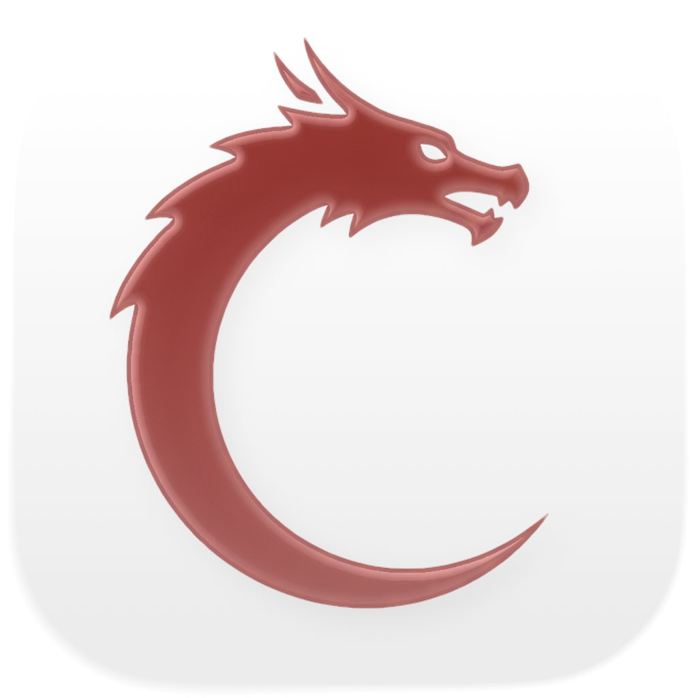
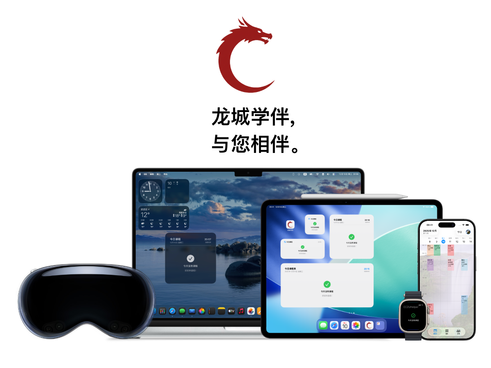

<div align="center">


<h3>龙城学伴 · CCZUHelper</h3>

   

简体中文 · 繁體中文 · English · 日本語 · 한국어
</div>

## 简介

龙城学伴是一款面向常州大学学生的第三方校园应用，用 **SwiftUI + Swift Concurrency** 编写，UI 层全平台复用，一份代码跑在 iPhone / iPad / Mac / Apple Watch / Vision Pro 上。

教务数据通过自研客户端库 [CCZUKit](https://github.com/RayanceKing/CCZUKit) 获取（SSO / WebVPN），本地数据落 SwiftData，课表与设置可通过 CloudKit + App Group 在多端与小组件之间同步。



> 本项目为个人开发的非官方项目，与常州大学各职能部门无隶属关系。使用前请仔细阅读 GPL-3.0 许可。

## 功能一览

### 📅 课程表

| 能力 | 说明 |
| --- | --- |
| 一键导入 | 从教务系统同步本学期课表，自动解析周次 / 节次 / 地点 / 教师 |
| 多课表管理 | 支持多份课表共存、切换、重命名、分享与删除 |
| ICS 互通 | 导入 `.ics` 课表，导出为日历文件 |
| 学期设置 | 自定义学期开始日期、周起始日、各节次上下课时间 |
| 显示模式 | 标准时间轴 / 上课节次轴、当前时间线、网格线、时间标尺、玻璃拟态外观 |
| 课程详情 | 顶部切换「编辑课程信息 / 仅调整本周」：可改色、星期、节次、地点、教师、备注，或只把本周这一节调到别的周次；底部支持删除整门课程 |
| 系统日历 | 一键同步到系统日历，修改与删除会重新刷写，保持与 App 内一致 |
| 本地通知 | 课前提醒（可选节假调休自动跳过），到点推送 |

### 📊 学业数据与教务服务

- 成绩查询：按学期查看各科成绩
- 学分绩点：自动统计 GPA 与学分分布
- 考试安排：考试时间、地点与考前提醒
- 一键评价：未评价课程批量提交默认评价
- 电费查询：宿舍电量余额查询
- 体测成绩、竞赛信息查询（学科竞赛检索接口）
- 选课系统、培养方案、教学通知等常用教务入口
- 快捷外链：教务系统、学校邮箱、WebVPN、智慧校园

### ⚡ 系统集成

- 桌面小组件：课表小组件（多尺寸）+ 下一节课**实时活动 / 灵动岛**
- Apple Watch：表盘小组件 + Watch App，通过 Watch Connectivity 接收课表快照
- 快捷指令：完整的 App Intents
  - 打开课表 / 打开成绩
  - 查询今日课表、明日课表、指定日期课表
  - 今天有没有课、下一节课是什么
  - 查询考试安排、成绩、GPA
- 主屏幕快速操作：长按图标直达课表 / 成绩 / 茶楼

### 🍵 茶楼（校园社区）

- 发帖、图片上传、评论与点赞
- 个人主页、自定义资料、他人主页浏览
- 举报与内容审核、屏蔽 / 拉黑列表、违规内容处理
- 端侧摘要能力（按机型可用性自动降级）
- 数据由 Supabase 承载（PostgREST + Realtime + Storage）

### ☁️ 账号与同步

- 教务账号经 Keychain 安全存储，支持跨设备同步与自动登录恢复
- 学伴账号（邮箱验证）用于茶楼等云端功能
- iCloud：设置项双向合并同步、图片云端同步、SwiftData 迁 CloudKit 容器

### 💎 会员

- 会员权益体系与购买页，状态由服务端校验

## 平台与系统要求

| 平台 | 最低版本 |
| --- | --- |
| iOS / iPadOS | 17.6 |
| macOS | 15.6 |
| watchOS | 11.0 |
| visionOS | 26.0 |

- Swift Toolchain 5.9+（项目使用 Swift Concurrency / async-await）
- Xcode 26+（visionOS 26 SDK）

## 快速开始

1. 克隆仓库

```bash
git clone https://github.com/RayanceKing/CCZUHelper
cd CCZUHelper
```

2. 打开 `CCZUHelper.xcodeproj`，等待 Swift Package Manager 自动拉取依赖，或在 **File ▸ Add Packages...** 中手动添加 [CCZUKit](https://github.com/RayanceKing/CCZUKit)（主分支）。

3. 配置签名与三项共享能力，使 App、Widget、Watch App 之间数据互通：

| 项 | 值 |
| --- | --- |
| Bundle Identifier（主 App） | `com.stuwang.edupal` |
| App Group | `group.com.stuwang.edupal` |
| iCloud Container | `iCloud.com.stuwang.edupal` |

主 App 还需开启：CloudKit、iCloud Documents、Keychain Sharing、Siri、推送与时敏通知。

4. 云端配置在 `CCZUHelper/Shared/AppConstants.swift`：Supabase 地址与匿名公钥、各类教务 URL、服务端 API 地址。自建部署时替换为自己的实例即可。

> 注：仓库内存的是 Supabase 客户端**可公开**的 `anon/publishable` key，不代表可以绕过数据库的行级安全策略（RLS）。生产使用请务必保留 RLS 规则。

5. 选择任意 target 直接 Run。首次使用需在 App 内完成教务账号登录并导入课表。

> 不想连真实教务系统的调试者，可查看 [docs/TEST_ACCOUNT_USAGE.swift](docs/TEST_ACCOUNT_USAGE.swift) 使用内置测试账户（`test@edupal.czumc.cn`），配合 `Models/TestData.swift` 的样例数据快速跑通课表与学籍信息。

## 项目结构

```
CCZUHelper/
├─ CCZUHelper/                     主 App（iPhone / iPad / Mac / Vision Pro）
│  ├─ AppIntents/                  App Intents 与 AppShortcutsProvider
│  ├─ Extensions/                  网络与错误展示扩展
│  ├─ Models/                      SwiftData 模型、账号同步、日历同步、
│  │                               通知、Setting 同步、Supabase 客户端等
│  │  └─ Teahouse/                 茶楼服务端交互（帖子/评论/点赞/审核/实时）
│  ├─ Shared/                      跨模块共享代码
│  │  ├─ AppConstants.swift        所有 URL / key / Endpoint 常量
│  │  ├─ ClassTimeConfig.swift     节次时间表
│  │  ├─ ScheduleSelection.swift   小组件与主 App 的课表选择协议
│  │  └─ Utilities/                日期格式化、URL 构造、密码强度等
│  └─ Views/
│     ├─ Components/               课表网格、课程块、课程详情与调课弹窗等
│     ├─ Services/                 成绩、绩点、考试、评教、电费、体测、选课、培养方案
│     ├─ Settings/                 外观 / 显示 / 学期 / 账户等设置分段
│     ├─ Teahouse/                 茶楼 UI（帖子详情、发布、举报、个人主页）
│     ├─ ScheduleView.swift        课表主页
│     └─ ManageSchedulesView.swift 多课表管理与导入导出
├─ CCZUHelperWidget/               主 App 桌面小组件 + 下一节课实时活动
├─ WatchWidget/                    watchOS 小组件
├─ widget/                         iOS 控制类小组件
├─ CCZUHelperLite Watch App/       Watch App 与 WatchConnectivity 接收端
├─ docs/                           开发文档（测试账户说明等，不参与编译）
└─ Localizable.xcstrings           简中 / 繁中 / 英 / 日 / 韩 多语言资源
```

## 技术栈

| 领域 | 选型 |
| --- | --- |
| UI | SwiftUI（含 Liquid Glass、iOS 26 新 API 分层适配） |
| 异步 | Swift Concurrency（async / await、Task、Actor） |
| 持久化 | SwiftData + CloudKit 双配置容灾 |
| 跨端数据 | App Group / UserDefaults / CloudKit KVS / Watch Connectivity |
| 网络 | URLSession + CCZUKit 教务客户端 |
| 后端 | Supabase（Auth / PostgREST / Realtime / Storage） |
| 媒体 | Kingfisher（图片加载缓存）、Mantis（图片裁剪） |
| 富文本 | MarkdownUI |
| 通知 / 日历 | UserNotifications、EventKit 系统日历写入 |

## 数据来源与致谢

- 教务数据接口：[CCZUKit](https://github.com/RayanceKing/CCZUKit)（常州大学教务系统的 Swift 客户端，本项目深度依赖）
- 社区与会员服务：Supabase
- 图片处理：Kingfisher、Mantis（均使用社区 fork 版本）

## 许可

本项目基于 [GNU General Public License v3.0](LICENSE) 开源。

- 允许自由使用、复制、修改与再分发
- 衍生的再分发版本必须同样以 GPL-3.0 开源，并提供源码
- 不含任何 Warranty；请勿用于任何违反学校规定或相关法律法规的用途

使用本项目前，请阅读 [用户协议](https://www.czumc.cn/terms) 与 [隐私政策](https://www.czumc.cn/privacy)。
